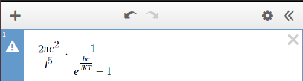
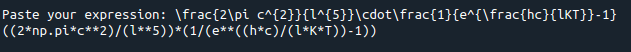

# Latex2Python

Frustrated from typing out complex mathematical expressions with tons of brackets in Python? This simple program takes a Latex expression generated by a symbolic maths builder and converts it to clean, syntactically correct Python code.

## Usage

Type out your maths quickly in SymboLab, Desmos etc.

Highlight and Copy

Run `latex2python.py` using `python latex2python.py` in the terminal, or just normally in an IDE

Paste when prompted and hit Enter

Done!

## Requirements

`python 3.`

